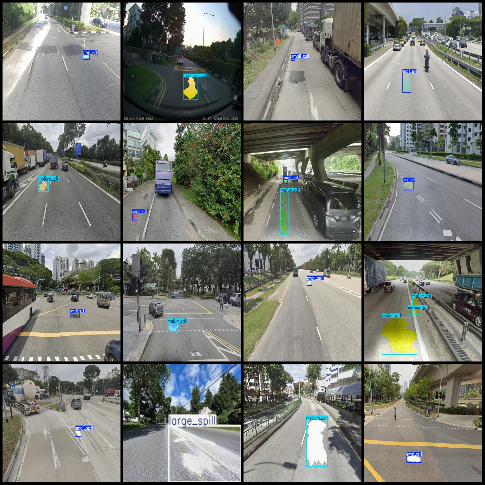
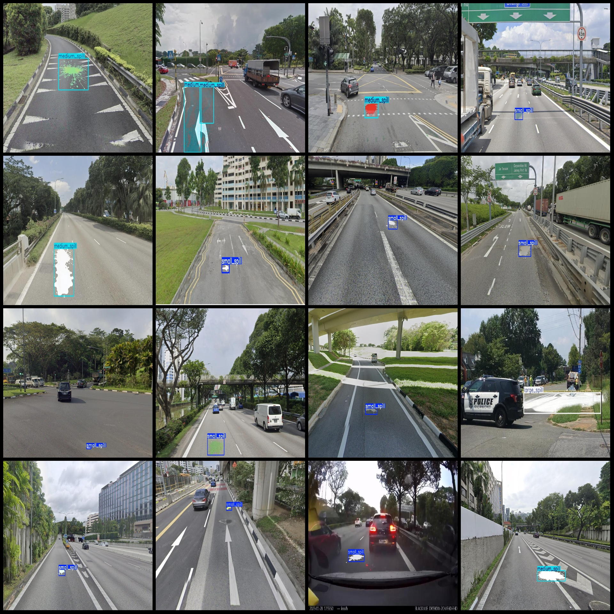

# Intelligent Traffic Roadway Liquid Spill Detection Dataset VOC+YOLO Format, 1192 Images in 3 Categories

Note: All images depict roadway liquid spills, mainly paint.
Dataset format: Pascal VOC format + YOLO format (excluding the split path's txt file, only containing jpg images along with corresponding VOC format xml files and yolo format txt files).
Number of images (jpg file counts): 1192
Number of annotations (xml file counts): 1192
Number of annotations (txt file counts): 1192
Number of annotation categories: 3
Annotation category names (note that the order of yolo format categories does not correspond to this, but is based on the labels folder 'classes.txt'): ["large_spill", "medium_spill", "small_spill"]
Number of bounding boxes for each category:
- Large spill (large area liquid) bounding box count = 60
- Medium spill (medium area liquid) bounding box count = 276
- Small spill (small area liquid) bounding box count = 998
Total bounding box count: 1334
Image resolution: Multi-resolution images, such as 2068x1286, 2059x1283, etc.
Used annotation tool: labelImg
Annotation rules: Draw a bounding box for each category
Important Notice: No provision made by this dataset for accuracy guarantees of trained models or weight files.
Image preview:
Annotation example:

## Images

Here is a pay link on Stripe ( https://buy.stripe.com/3cs8yP7sY87d0vu9AB ). Please contact me lonlonago@foxmail.com after funding $89, and I will send you a complete data files , thank you!

